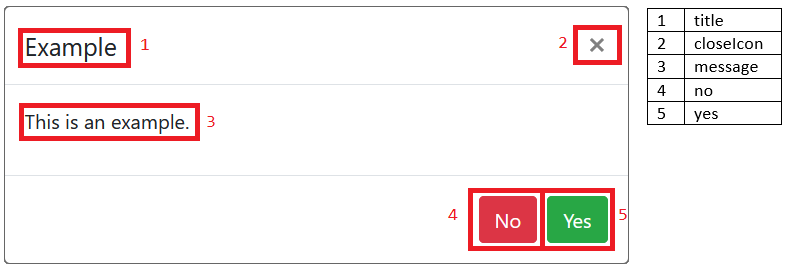

# Bootstrap Confirmation Modal

A simple solution for displaying and handling Bootstrap confirmation modals on the fly.

## Bootstrap V4 and V5
Bootstrap made major changes in version 5, namely that Bootstrap 5 is designed to be used without jQuery. To accommodate this change, the confirmation modal is split up between two separate directories, [v4](./src/v4) which uses jQuery and another for [v5](./src/v5) which uses plain Javascript.

### Compatibility
[v5](./src/v5) uses modern ES6 code, specifically [JavaScript classes: Private class methods](https://caniuse.com/mdn-javascript_classes_private_class_methods).

## Demo
Demo Files: [./demo](./demo)

Fiddle (v4): https://jsfiddle.net/s3w2cqfk/

Fiddle (v5): https://jsfiddle.net/dfkrvt8x/

## Dependencies
### CSS
 - Bootstrap 4.5.3 or 5.0

### JavaScript
 - jQuery 3.5.1 (if targeting Bootstrap 4)
 - Bootstrap 4.5.3 or 5.0

## Usage
### Simplest Usage
```js
confirmationModal.show();
```

### Complex Usage
```js
confirmationModal.show({
    closeIcon: true,
    message: 'This is an example.',
    title: 'Example',
    no: {
        class: 'btn btn-danger',
        text: 'No'
    },
    yes: {
        class: 'btn btn-success',
        text: 'Yes'
    }
})
    .then(() => {
        console.log('yes');
    })
    .catch(() => {
        console.log('no');
    });
```

## Configuration
The `confirmationModal.show` function takes an optional parameter that, when present, should be an object as represented by this picture:



### config
Object with the following properties:
|    Name   |     Type     |                    Default                   |                                      Description                                      |
|-----------|--------------|----------------------------------------------|---------------------------------------------------------------------------------------|
| closeIcon | boolean      | false                                        | Toggles the visibility of the close icon button in the top-right corner of the modal. |
| message   | string       | ''                                           | The text inside the modal-body element.                                               |
| title     | string       | ''                                           | The text inside the modal-title element                                               |
| no        | actionButton | { class: 'confirmation-no', text: 'Cancel' } | Specifies the class and text properties of the 'no' button.                           |
| yes       | actionButton | { class: 'confirmation-yes', text: 'Ok' }    | Specifies the class and text properties of the 'yes' button                           |

#### actionButton
Object with the following properties:
|  Name |  Type  |                  Description                 |
|-------|--------|----------------------------------------------|
| class | string | The class attribute of the respective button |
| text  | string | The text of the respective button            |

## Donate
Show your support! Your (non-tax deductible) donation of Monero cryptocurrency is a sign of solidarity among web developers.

Being self taught, I have come a long way over the years. I certainly do not intend on making a living from this free feature, but my hope is to earn a few dollars to validate all of my hard work.

Monero Address: 447SPi8XcexZnF7kYGDboKB6mghWQzRfyScCgDP2r4f2JJTfLGeVcFpKEBT9jazYuW2YG4qn51oLwXpQJ3oEXkeXUsd6TCF


