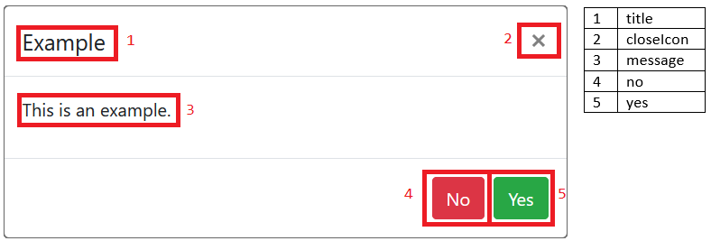

# Bootstrap Confirmation Modal

A simple jQuery solution for displaying and handling Bootstrap confirmation modals on the fly.


## Dependencies
### CSS
 - Bootstrap 4.5.3

### JavaScript
 - jQuery 3.5.1
 - Bootstrap 4.5.3

## Usage
### Simplest Usage
```js
bootstrapConfirmation();
```

### Complex Usage
```js
bootstrapConfirmation({
    yesCallBack: function () {
        console.log('yes');
    },
    noCallBack: function () {
        console.log('no');
    },
    config: {
        closeIcon: true,
        message: 'This is an example.',
        title: 'Example',
        no: {
            class: 'btn btn-danger',
            text: 'No'
        },
        yes: {
            class: 'btn btn-success',
            text: 'Yes'
        }
    }
});
```

## Configuration
The `bootstrapConfirmation` function takes an optional parameter that, when present, should be an object as represented by this picture:



### config
|    Name   |     Type     |                    Default                   |                                      Description                                      |
|-----------|--------------|----------------------------------------------|---------------------------------------------------------------------------------------|
| closeIcon | boolean      | false                                        | Toggles the visibility of the close icon button in the top-right corner of the modal. |
| message   | string       | ''                                           | The text inside the modal-body element.                                               |
| title     | string       | ''                                           | The text inside the modal-title element                                               |
| no        | actionObject | { class- 'confirmation-no', text- 'Cancel' } | Specifies the class and text properties of the 'no' button.                           |
| yes       | actionObject | { class- 'confirmation-yes', text- 'Ok' }    | Specifies the class and text properties of the 'yes' button                           |

#### actionButton
|  Name |  Type  |                  Description                 |
|-------|--------|----------------------------------------------|
| class | string | The class attribute of the respective button |
| text  | string | The text of the respective button            |

### yesCallBack
Function that gets executed when the user clicks on the 'yes' button.

### noCallBack
Function that gets executed when the user clicks on the 'no' button.
